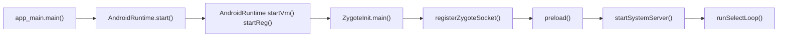

#### Android系统启动的大概流程

**第一步： 启动电源以及系统启动** 

当电源按下，引导芯片代码开始从预定义的地方（固化在ROM）开始执行。加载引导程序到RAM，然后执行 

**第二步：引导程序** 

引导程序是在Android操作系统开始运行前的一个小程序。引导程序是运行的第一个程序，因此它是针对特定的主板与芯片的。设备制造商要么使用很受欢迎的引导程序比如redboot、uboot、qi  bootloader或者开发自己的引导程序，它不是Android操作系统的一部分。引导程序是OEM厂商或者运营商加锁和限制的地方。 

引导程序分两个阶段执行。

第一个阶段，检测外部的RAM以及加载对第二阶段有用的程序； 

第二阶段，引导程序设置网络、内存等等。这些对于运行内核是必要的，为了达到特殊的目标，引导程序可以根据配置参数或者输入数据设置内核。

Android引导程序可以在\bootable\bootloader\legacy\usbloader找到。传统的加载器包含两个文件， 需要在这里说明： 

init.s初始化堆栈，清零BBS段，调用main.c的_main()函数； 

main.c初始化硬件（闹钟、主板、键盘、控制台），创建linux标签 

**第三步：内核** 

Android内核与桌面linux内核启动的方式差不多。内核启动时，设置缓存、被保护存储器、计划列表， 加载驱动。当内核完成系统设置，它首先在系统文件中寻找”init”文件，然后启动root进程或者系统的第 一个进程 

**第四步：init进程**

 init进程是Linux系统中用户空间的第一个进程，进程号固定为1。Kernel启动后，在用户空间启动init进 程，并调用init中的main()方法执行init进程的职责。 

**第五步：启动系统服务，Lancher App**

 #### init进程分析

其中init进程是Android系统中及其重要的第一个进程，接下来看下init进程主要做了些什么 

1. 创建和挂载启动所需要的文件目录
2. 初始化和启动属性服务 
3. 解析init.rc配置文件并启动Zygote进程

```c++
// \system\core\init\init.cpp main()
 /*
  * 1.C++中主函数有两个参数，第一个参数argc表示参数个数，第二个参数是参数列表，也就是具体的参数
  * 2.init的main函数有两个其它入口，一是参数中有ueventd，进入ueventd_main,二是参数中有watchdogd，进入watchdogd_main
  */
 int main(int argc, char** argv) {
 /*
  * 1.strcmp是String的一个函数，比较字符串，相等返回0
  * 2.C++中0也可以表示false
  * 3.basename是C库中的一个函数，得到特定的路径中的最后一个'/'后面的内容，
  * 比如/sdcard/miui_recovery/backup，得到的结果是backup
  */
 	if (!strcmp(basename(argv[0]), "ueventd")) {//当argv[0]的内容为ueventd时，strcmp的值为0,！strcmp为1
  		//1表示true，也就执行ueventd_main,ueventd主要是负责设备节点的创建、权限设定等一些列工作
        return ueventd_main(argc, argv);
    }
    if (!strcmp(basename(argv[0]), "watchdogd")) {//watchdogd看门狗，用于系统出问题时重启系统
        return watchdogd_main(argc, argv);
    }
     ...
     property_init();//初始化属性系统，并从指定文件读取属性
     LoadBootScripts(am, sm);//解析xxx.rc   
 }
```

#### init.rc解析

init.rc是一个非常重要的配置文件，它是由Android初始化语言（Android Init Language）编写的脚 本，它主要包含五种类型语句：Action（Action中包含了一系列的Command）、Commands（init语言 中的命令）、Services（由init进程启动的服务）、Options（对服务进行配置的选项）和Import（引入 其他配置文件）。init.rc的配置代码如下所示。

```c++
# \system\core\rootdir\init.rc
import /system/etc/init/hw/init.${ro.zygote}.rc
on early-init && property:ro.product.cpu.abilist32=*
    exec_start boringssl_self_test32
on init
    start servicemanager
    start hwservicemanager
    
on zygote-start && property:ro.crypto.state=encrypted && property:ro.crypto.type=file
    wait_for_prop odsign.verification.done 1
    # A/B update verifier that marks a successful boot.
    exec_start update_verifier_nonencrypted
    start statsd
    start netd
    start zygote
    start zygote_secondary
    
on <trigger> [&& <trigger>]* //设置触发器
     <command>
     <command> //动作触发之后要执行的命令
    
service <name> <pathname> [ <argument> ]* //<service的名字><执行程序路径><传递参数>
     <option>  //Options是Services的参数配置. 它们影响Service如何运行及运行时机
     group <groupname> [ <groupname>\* ] 
    //在启动Service前将group改为第一个groupname,第一个groupname是必须有的，默认值为root（或许默认值是无），第二个     		//groupname可以不设置，用于追加组（通过setgroups）
     priority <priority> //设置进程优先级. 在-20～19之间，默认值是0,通过setpriority实现
     socket <name> <type> <perm> [ <user> [ <group> [ <seclabel> ] ] ]
    //创建一个unix域的socket,名字叫/dev/socket/name, 并将fd返回给Service. type 只能是"dgram", "stream" or 			//"seqpacket".
       ...  
```

**Action**  

Action： 通过触发器trigger，即以on开头的语句来决定执行相应的service的时机，具体有如下时机： 

- on early-init; 在初始化早期阶段触发； 
- on init; 在初始化阶段触发； 
- on late-init; 在初始化晚期阶段触发； 
- on boot/charger： 当系统启动/充电时触发，还包含其他情况； 
- on property:=: 当属性值满足条件时触发

**Service**  

服务Service，以 service开头，由init进程启动，一般运行在init的一个子进程，所以启动service前需要判断对应的可执行文件是否存在。init生成的子进程，定义在rc文件，其中每一个service在启动时会通过 fork方式生成子进程。

例如： service servicemanager /system/bin/servicemanager代表的是服务名为 servicemanager，服务执行的路径为/system/bin/servicemanager。

**Command**  

 常用的命令 

- class_start ： 启动属于同一个class的所有服务； 
- start ： 启动指定的服务，若已启动则跳过； 
- stop ： 停止正在运行的服务 
- setprop  ：设置属性值 
- mkdir ：创建指定目录 
- symlink  ： 创建连接到的符号链接； 
- write  ： 向文件path中写入字符串；
- exec： fork并执行，会阻塞init进程直到程序完毕； 
- exprot  ：设定环境变量； 
- loglevel ：设置log级别

**Options**

Options是Service的可选项，与service配合使用

- disabled: 不随class自动启动，只有根据service名才启动； 
- oneshot: service退出后不再重启； 
- user/group： 设置执行服务的用户/用户组，默认都是root； 
- class：设置所属的类名，当所属类启动/退出时，服务也启动/停止，默认为default； 
- onrestart:当服务重启时执行相应命令； 
- socket: 创建名为/dev/socket/的socket 
- critical: 在规定时间内该service不断重启，则系统会重启并进入恢复模式 

default: 意味着disabled=false，oneshot=false，critical=false。

#### service解析流程

```c++
// \system\core\init\init.cpp LoadBootScripts()
 static void LoadBootScripts(ActionManager& action_manager, ServiceList& 
service_list) {
    Parser parser = CreateParser(action_manager, service_list);//创建解析器
    std::string bootscript = GetProperty("ro.boot.init_rc", "");
    if (bootscript.empty()) {
        parser.ParseConfig("/init.rc");
        if (!parser.ParseConfig("/system/etc/init")) {
            late_import_paths.emplace_back("/system/etc/init");
        }
        if (!parser.ParseConfig("/product/etc/init")) {
            late_import_paths.emplace_back("/product/etc/init");
        }
        if (!parser.ParseConfig("/odm/etc/init")) {
            late_import_paths.emplace_back("/odm/etc/init");
        }
        if (!parser.ParseConfig("/vendor/etc/init")) {
            late_import_paths.emplace_back("/vendor/etc/init");
        }
    } else {
        parser.ParseConfig(bootscript);//开始解析
    }
}
 Parser CreateParser(ActionManager& action_manager, ServiceList& 
service_list) {
    Parser parser;
    parser.AddSectionParser("service", std::make_unique<ServiceParser>
 (&service_list, subcontexts));//service解析
    parser.AddSectionParser("on", std::make_unique<ActionParser>
 (&action_manager, subcontexts));
    parser.AddSectionParser("import", std::make_unique<ImportParser>
 (&parser));
    return parser;
 }

Parser.ParseConfig() -> Parser::ParseData() -> ServiceParser::ParseSection()...->ServiceList::AddService()
```

解析完成后，接下来就是启动Service,以启动Zygote来分析

```c++
 # \system\core\rootdir\init.rc
 on nonencrypted
    class_start main //class_start是一个命令，通过do_class_start函数处理
    class_start late_start
     
// \system\core\init\builtins.cpp do_class_start()
 static Result<Success> do_class_start(const BuiltinArguments& args) {
    // Starting a class does not start services which are explicitly disabled.
    // They must  be started individually.
    for (const auto& service : ServiceList::GetInstance()) {
        if (service->classnames().count(args[1])) {
            if (auto result = service->StartIfNotDisabled(); !result) {
                LOG(ERROR) << "Could not start service '" << service->name()
                           << "' as part of class '" << args[1] << "': " << 
							result.error();
            }
        }
    }
    return Success();
 }
// \system\core\init\service.cpp Service::StartIfNotDisabled() -> Service::Start() 
Result<Success> Service::Start() {
     //如果子进程没有启动，则调用fork函数创建子进程
    pid_t pid = -1;
    if (namespace_flags_) {
        pid = clone(nullptr, nullptr, namespace_flags_ | SIGCHLD, nullptr);
    } else {
        pid = fork();
    }
    if (pid == 0) {//当期代码逻辑在子进程中运行
        umask(077);
      
  		//调用execv函数，启动sevice子进程
        if (!ExpandArgsAndExecv(args_)) {
            PLOG(ERROR) << "cannot execve('" << args_[0] << "')";
        }
        _exit(127);
    }
    return Success()
}
```

#### Zygote

主要用于孵化子进程。在Android系统中有以下两种程序：

-  java应用程序，主要基于ART虚拟机，所有的应用程序apk都属于这类
- native程序，也就是利用C或C++语 言开发的程序，如bootanimation。

所有的Java应用程序进程及系统服务SystemServer进程都由Zygote 进程通过Linux的fork()函数孵化出来的，这也就是为什么把它称为Zygote的原因。

Zygote进程最初的名字不是“zygote”而是 “app_process”，这个名字是在Android.mk文件中定义的 

Zgyote是Android中的第一个art虚拟机，他通过socket的方式与其他进程进行通信。这里的“其他进程” 其实主要是系统进程——SystemServer

```
Zygote是一个C/S模型，Zygote进程作为服务端，它主要负责创建Java虚拟机，加载系统资源，启 动SystemServer进程，以及在后续运行过程中启动普通的应用程序，其他进程作为客户端向它发 出“孵化”请求，而Zygote接收到这个请求后就“孵化”出一个新的进程。比如，当点击Launcher里的 应用程序图标去启动一个新的应用程序进程时，这个请求会到达框架层的核心服务 ActivityManagerService中，当AMS收到这个请求后，它通过调用Process类发出一个“孵化”子进 程的Socket请求，而Zygote监听到这个请求后就立刻fork一个新的进程出来。
```

#### Zygote触发过程

1、init zygote

```
import /init.${ro.zygote}.rc
```

init.zygoteXX.rc  ${ro.zygote} 会被替换成 ro.zyogte 的属性值，这个是由不同的硬件厂商自己定制的， 有四个值， 

- zygote32： zygote 进程对应的执行程序是 app_process (纯 32bit 模式) 
- zygote64： zygote 进程对应的执行程序是 app_process64 (纯 64bit 模式) 
- zygote32_64： 启动两个 zygote 进程 (名为 zygote 和 zygote_secondary)，对应的执行程序分别 是 app_process32 (主模式) 
- zygote64_32：  启动两个 zygote 进程 (名为 zygote 和 zygote_secondary)，对应的执行程序分别 是 app_process64 (主模式)、app_process32

```c++
//\system\core\rootdir\init.zygote64.rc
service zygote /system/bin/app_process64 -Xzygote /system/bin --zygote --start-system-server
    class main
    priority -20
    user root
    group root readproc reserved_disk
    socket zygote stream 660 root system
    socket usap_pool_primary stream 660 root system
    onrestart exec_background - system system -- /system/bin/vdc volume abort_fuse
    onrestart write /sys/power/state on
    onrestart restart audioserver
    onrestart restart cameraserver
    onrestart restart media
    onrestart restart media.tuner
    onrestart restart netd
    onrestart restart wificond
    task_profiles ProcessCapacityHigh
    critical window=${zygote.critical_window.minute:-off} target=zygote-fatal
    
```

2、start zygote 位置：system\core\rootdir\init.rc 

```
on zygote-start && property:ro.crypto.state=encrypted && property:ro.crypto.type=file
    # A/B update verifier that marks a successful boot.
    exec_start update_verifier_nonencrypted
    start netd
    start zygote
    start zygote_secondary

on late-init
    trigger early-fs
	...
    # Now we can start zygote for devices with file based encryption
    trigger zygote-start
```

```c++
// \system\core\init\init.cpp
int SecondStageMain(int argc, char** argv) {
// Don't mount filesystems or start core system services in charger mode.
    std::string bootmode = GetProperty("ro.bootmode", "");
    if (bootmode == "charger") {
        am.QueueEventTrigger("charger");
    } else {
        am.QueueEventTrigger("late-init");
    }
}
```

3、app_processXX 位置\frameworks\base\cmds\app_process\

```
 app_process_src_files := \
    app_main.cpp \
 LOCAL_SRC_FILES:= $(app_process_src_files)
 ...
 LOCAL_MODULE:= app_process
 LOCAL_MULTILIB := both
 LOCAL_MODULE_STEM_32 := app_process32
 LOCAL_MODULE_STEM_64 := app_process64
```

#### Zygote启动过程

位置\frameworks\base\cmds\app_process\app_main.cpp

 在app_main.cpp的main函数中，主要做的事情就是参数解析. 这个函数有两种启动模式：

1. 一种是zygote模式，也就是初始化zygote进程，传递的参数有--start-system-server --socket name=zygote，前者表示启动SystemServer，后者指定socket的名称 
2.  一种是application模式，也就是启动普通应用程序，传递的参数有class名字以及class带的参数 两者最终都是调用AppRuntime对象的start函数，加载ZygoteInit或RuntimeInit两个Java类，并将之前整理的参数传入进去



app_process

```C++
// \frameworks\base\cmds\app_process\app_main.cpp main()
 if (strcmp(arg, "--zygote") == 0) {
 zygote = true;
 niceName = ZYGOTE_NICE_NAME;
 } else if (strcmp(arg, "--start-system-server") == 0) {
 startSystemServer = true;
 } else if (strcmp(arg, "--application") == 0) {
           application = true;
  }
 // L349       
 if (zygote) {
       //这些Java的应用都是通过 AppRuntime.start（className)开始的
       //其实AppRuntime是AndroidRuntime的子类，它主要实现了几个回调函数，而start()方法是实现在AndroidRuntime这个方法类里
        runtime.start("com.android.internal.os.ZygoteInit", args, zygote);
    } else if (className) {
        runtime.start("com.android.internal.os.RuntimeInit", args, zygote);
    } 
```

app_process 里面定义了三种应用程序类型： 

1. Zygote:  com.android.internal.os.ZygoteInit 
2. System Server, 不单独启动，而是由Zygote启动 
3. 其他指定类名的Java 程序

#### 什么是Runtime

Runtime 是支撑程序运行的基础库，它是与语言绑定在一起的。比如：

C Runtime：就是C standard lib, 也就是常说的libc。

Java Runtime: 包括Java 的支撑类库 （.jar). 

AndroidRuntime:  为Android应用运行所需的运行时环境。这个环境包括以下内容：

1. Dalvik/ART VM: Android的Java VM, 解释运行Dex格式Java程序。每个进程运行一个虚拟机。 
2. Android的Java 类库, 开源的Java API 实现，如 java.lang,  java.util, java.net. 但去除了AWT, Swing 等部件。
3. JNI: C和Java互调的接口。
4. Libc: Android也有很多C代码，自然少不了libc，注意的是，Android的libc叫 bionic C

```c++
// \frameworks\base\core\jni\androidRuntime.cpp start()
 void AndroidRuntime::start(const char* className, const Vector<String8>& 
options, bool zygote)
 {
    ...
    JNIEnv* env;
    //JNI_CreateJavaVM 
    if (startVm(&mJavaVM, &env, zygote) != 0) {
        return;
    }
  
    onVmCreated(env);
    /*
     * Register android functions
      */
 if (startReg(env) < 0) {
 ALOGE("Unable to register all android natives\n");
 return;
 }
 ...
 }
```

 Java虚拟机的启动大致做了以下一些事情：

1. 从property读取一系列启动参数。 
2. 创建和初始化结构体全局对象（每个进程）gDVM，及对应与JavaVM和JNIEnv的内部结构体  JavaVMExt, JNIEnvExt. 
3. 初始化java虚拟机，并创建虚拟机线程 
4.  注册系统的JNI，Java程序通过这些JNI接口来访问底层的资源。 （”javacore”, “nativehelper”)  

5. 为Zygote的启动做最后的准备，包括设置SID/UID, 以及mount 文件系统
6. 返回JavaVM 给Native代码，这样它就可以向上访问Java的接口

除了系统的JNI接口（”javacore”, “nativehelper”), android framework 还有大量的Native实现， Android将所有这些接口一次性的通过start_reg()来完成

#### ZygotInit

```java
// \frameworks\base\core\java\com\android\internal\os\ZygotInit.java main()
 public static void main(String argv[]) {
        ZygoteServer zygoteServer = new ZygoteServer(); //新建Zygote服务器端
      ...
        final Runnable caller;
        try {
            ...
            boolean startSystemServer = false;
            String socketName = "zygote";Dalvik VM进程系统
            String abiList = null;
            boolean enableLazyPreload = false;
            for (int i = 1; i < argv.length; i++) {
                //app_main.cpp中传的start-system-server参数，在这里用到
                if ("start-system-server".equals(argv[i])) {
                    startSystemServer = true;
                } else if ("--enable-lazy-preload".equals(argv[i])) {
                    enableLazyPreload = true;
                } else if (argv[i].startsWith(ABI_LIST_ARG)) {
                    abiList = argv[i].substring(ABI_LIST_ARG.length());
                } else if (argv[i].startsWith(SOCKET_NAME_ARG)) {
                    socketName = argv[i].substring(SOCKET_NAME_ARG.length())
                } else {
                    throw new RuntimeException("Unknown command line argument: " + argv[i]);
                }
            }
            zygoteServer.registerServerSocketFromEnv(socketName);//注册Socket
            // In some configurations, we avoid preloading resources and classes eagerly.
            // In such cases, we will preload things prior to our first fork.
             // 在有些情况下我们需要在第一个fork之前进行预加载资源
            if (!enableLazyPreload) {
                preload(bootTimingsTraceLog);
            } else {
                Zygote.resetNicePriority();
            }
            // Do an initial gc to clean up after startup
            bootTimingsTraceLog.traceBegin("PostZygoteInitGC");
            //主动进行一次资源GC 。gc()必须在fork之前完成（接下来的StartSystemServer就会有fork操作），
            //这样将来被复制出来的子进程才能有尽可能少的垃圾内存
            gcAndFinalize();
            Zygote.nativeSecurityInit();
            // Zygote process unmounts root storage spaces.
            Zygote.nativeUnmountStorageOnInit();
            ZygoteHooks.stopZygoteNoThreadCreation();
            if (startSystemServer) {
                Runnable r = forkSystemServer(abiList, socketName, zygoteServer);
                // {@code r == null} in the parent (zygote) process, and {@code r != null} in the
                // child (system_server) process.
                if (r != null) {
                    r.run();
                    return;
                }
            }
            Log.i(TAG, "Accepting command socket connections")      
            // The select loop returns early in the child process after a fork and
            // loops forever in the zygote.
            caller = zygoteServer.runSelectLoop(abiList);
        } catch (Throwable ex) {
            Log.e(TAG, "System zygote died with exception", ex);
            throw ex;
        } finally {
            zygoteServer.closeServerSocket();
        }
        // We're in the child process and have exited the select loop. Proceed to execute the command.
        if (caller != null) {
            caller.run();
        }
    }
```

preload() 的作用就是提前将需要的资源加载到VM中，比如class、resource等

```java
// \frameworks\base\core\java\com\android\internal\os\ZygotInit.java preload()
 static void preload(TimingsTraceLog bootTimingsTraceLog) {
        Log.d(TAG, "begin preload");
        //加载指定的类到内存并且初始化，使用的Class.forName(class, true, null);方式
        preloadClasses();
        bootTimingsTraceLog.traceEnd(); // PreloadClasses
        bootTimingsTraceLog.traceBegin("PreloadResources");
        //加载Android通用的资源，比如drawable、color...
        preloadResources();
        bootTimingsTraceLog.traceEnd(); // PreloadResources
        Trace.traceBegin(Trace.TRACE_TAG_DALVIK, "PreloadAppProcessHALs");
        nativePreloadAppProcessHALs();
        Trace.traceEnd(Trace.TRACE_TAG_DALVIK);
        Trace.traceBegin(Trace.TRACE_TAG_DALVIK, "PreloadOpenGL");
        //加载OpenGL...
        preloadOpenGL();
        Trace.traceEnd(Trace.TRACE_TAG_DALVIK);
        //加载共用的Library
        preloadSharedLibraries();
        //加载Text资源，字体等
        preloadTextResources();
        // Ask the WebViewFactory to do any initialization that must run in the zygote process,
        // for memory sharing purposes.
        // 为了内存共享，WebViewFactory进行任何初始化都要在Zygote进程中
        WebViewFactory.prepareWebViewInZygote();
        endIcuCachePinning();
        warmUpJcaProviders();
        Log.d(TAG, "end preload");
        sPreloadComplete = true;
 }
```

preloadClassess 将framework.jar里的preloaded-classes 定义的所有class load到内存里， preloaded-classes 编译Android后可以在framework/base下找到。

preloadResources 将系统的 Resource(不是在用户apk里定义的resource）load到内存。资源preload到Zygoted的进程地址空间， 所有fork的子进程将共享这份空间而无需重新load, 这大大减少了应用程序的启动时间，但反过来增加了 系统的启动时间。通过对preload 类和资源数目进行调整可以加快系统启动。Preload也是Android启动 最耗时的部分之一。

ZygoteInit.forkSystemServer() 方法fork 出一个新的进程，这个进程就是SystemServer进程。fork出来 的子进程在handleSystemServerProcess 里开始初始化工作，主要工作分为： 

1. prepareSystemServerProfile（）方法中将SYSTEMSERVERCLASSPATH中的AppInfo加载到VM 中。 
2.  判断fork args中是否有invokWith参数，如果有则进行WrapperInit.execApplication，如果没有则调用调用ZygoteInit.zygoteInit

```java
 \frameworks\base\core\java\com\android\internal\os\ZygotInit.java
public static Runnable zygoteInit(int targetSdkVersion, long[] disabledCompatChanges,
            String[] argv, ClassLoader classLoader) {
        Trace.traceBegin(Trace.TRACE_TAG_ACTIVITY_MANAGER, "ZygoteInit");
        RuntimeInit.redirectLogStreams();
        RuntimeInit.commonInit();
        ZygoteInit.nativeZygoteInit();
        return RuntimeInit.applicationInit(targetSdkVersion, disabledCompatChanges, argv,
                classLoader);
    }
```

```java
// \frameworks\base\core\java\com\android\internal\os\RuntimeInit.java applicationInit()
protected static Runnable applicationInit(int targetSdkVersion, String[] argv,ClassLoader classLoader) {
        ...
        // Remaining arguments are passed to the start class's static main
        //findStaticMain来运行args的startClass的main方法
        return findStaticMain(args.startClass, args.startArgs, classLoader);
    }
 protected static Runnable findStaticMain(String className, String[] argv,
            ClassLoader classLoader) {
        Class<?> cl;
        try {
            cl = Class.forName(className, true, classLoader);
        } catch (ClassNotFoundException ex) {
            throw new RuntimeException(
                    "Missing class when invoking static main " + className,
                    ex);
        }
        Method m;
        try {
            m = cl.getMethod("main", new Class[] { String[].class });
        } catch (NoSuchMethodException ex) {
            throw new RuntimeException(
                    "Missing static main on " + className, ex);
        } catch (SecurityException ex) {
            throw new RuntimeException(
                    "Problem getting static main on " + className, ex);
        }
        return new MethodAndArgsCaller(m, argv);
    }
```

接着在MethodAndArgsCaller的run方法中执行SystemServer的main方法。

#### System Server 启动流程

System Server是Zygote fork 的第一个Java 进程， 这个进程非常重要，因为他们有很多的系统线程， 提供所有核心的系统服务。还有很多“Binder-x”的线程，它们是各个Service为了响应应用程序远程调用请求而创建的。除此之外，还有很多内部的线程，比如 ”UI thread”, “InputReader”, “InputDispatch” 等等，现在只关心System Server是如何创建起来的。 SystemServer的main() 函数

```java
 public static void main(String[] args) {
    new SystemServer().run();
 }
```

  SystemServer run方法的初始化流程:

- 初始化必要的SystemServer环境参数，比如系统时间、默认时区、语言、load一些Library等等，
- 初始化Looper，我们在主线程中使用到的looper就是在SystemServer中进行初始化的 
- 初始化Context，只有初始化一个Context才能进行启动Service等操作
- 初始化SystemServiceManager,用来管理启动service，SystemServiceManager中封装了启动Service的 startService方法启动系统必要的Service，启动service的流程

**初始化Context**

```java
private void createSystemContext() {
     ActivityThread activityThread = ActivityThread.systemMain();
     mSystemContext = activityThread.getSystemContext();
     mSystemContext.setTheme(DEFAULT_SYSTEM_THEME);
     final Context systemUiContext = activityThread.getSystemUiContext();
     systemUiContext.setTheme(DEFAULT_SYSTEM_THEME);
 }
//ActivityThread
public ContextImpl getSystemContext() {
     synchronized (this) {
       if (mSystemContext == null) {
          mSystemContext = ContextImpl.createSystemContext(this);
       }
       return mSystemContext;
     }
 }
```

**初始化SystemServiceManager**

```java
 //SystemServer Start services.
 try {
     traceBeginAndSlog("StartServices");
     startBootstrapServices();
     startCoreServices();
     startOtherServices();
     SystemServerInitThreadPool.shutdown();
 } catch (Throwable ex) {
       //
 } finally {
     traceEnd();
 }
```

- 启动BootstrapServices,就是系统必须需要的服务，这些服务直接耦合性很高，所以干脆就放在一个方 法里面一起启动，比如PowerManagerService、RecoverySystemService、DisplayManagerService、 ActivityManagerService等
- 启动以基本的核心Service，比如BatteryService、 UsageStatsService、WebViewUpdateService等
- 启动其它需要用到的Service，比如 NetworkScoreService、AlarmManagerService等

最后Zygote会监控System  Server是否挂掉了，如果挂掉会将其回收，然后将自己杀掉，重新开始，这段实现在代码 ：dalvik/vm/native/dalvik_system_zygote.cpp   Dalvik_dalvik_system_Zygote_forkSystemServer中。

#### Zygote和SystemServer 总结 

1. init 根据init.rc 运行 app_process, 并携带‘–zygote’ 和 ’–startSystemServer’ 参数。 
2.  AndroidRuntime.cpp::start() 里将启动JavaVM，并且注册所有framework相关的系统JNI接口。 
3.  第一次进入Java世界，运行ZygoteInit.java::main() 函数初始化Zygote. Zygote 并创建Socket的 server 端。 
4. 然后fork一个新的进程并在新进程里初始化SystemServer. Fork之前，Zygote是preload常用的 Java类库，以及系统的resources，同时GC（）清理内存空间，为子进程省去重复的工作。
5. SystemServer 里将所有的系统Service初始化，包括ActivityManager 和 WindowManager, 他们 是应用程序运行起来的前提。
6.  于此同时，Zygote监听服务端Socket，等待新的应用启动请求。
7. ActivityManager ready 之后寻找系统的“Startup” Application, 将请求发给Zygote。
8. Zygote收到请求后，fork出一个新的进程。
9. Zygote监听并处理SystemServer 的 SIGCHID 信号，一旦System Server崩溃，立即将自己杀死。 init会重启Zygote。

#### 什么情况下Zygote进程会重启呢？  

- servicemanager进程被杀;  
- (onresart)surfaceflinger进程被杀; 
- (onresart)Zygote进程自己被杀;
-  (oneshot=false)system_server进程被杀; (waitpid）

#### fork函数

使用 f ork() 函数得到的子进程是父进程的一个复制品，它从父进程处继承了整个进程的地址空间：包括进程上下文（进程执行活动全过程的静态描述）、进程堆栈、打开的文件描述符、信号控 制设定、进程优先级、进程组号等。子进程所独有的只有它的进程号，计时器等（只有小量信 息）。因此，使用  fork() 函数的代价是很大的。

**子进程与父进程的区别**  

1. 除了文件锁以外,其他的锁都会被继承
2. 各自的进程ID和父进程ID不同
3. 子进程的未决告警被清除；
4. 子进程的未决信号集设置为空集。

**写时拷贝 (copy- on-write)**

Linux 的  fork() 使用是通过写时拷贝 (copy- on-write) 实现。写时拷贝是一种可以推迟甚至避免拷贝数据的技术。内核此时并不复制整个进程的地址空间，而是让父子进程共享同一个地址空间。只用在需要写入的时候才会复制地址空间，从而使各个进行拥有各自的地址空间。也就是说，资源的复制是在需要写入的时候才会进行，在此之前，只有以只读方式共享。

**孤儿进程、僵尸进程**  

fork系统调用之后，父子进程将交替执行，执行顺序不定。如果父进程先退出，子进程还没退出那么子进程的父进程将变为init进程（托孤给了init进程）。（注：任何一个进程都必须有父进程）如果子进程先退出，父进程还没退出，那么子进程必须等到父进程捕获到了子进程的退出状态才真正结束，否则这个时候子进程就成为僵进程（僵尸进程：只保留一些退出信息供父进程查询）。

**多线程进程的Fork调用**

在 POSIX 标准中，fork 的行为是这样的：复制整个用户空间的数据（通常使用 copy-on-write 的策略， 所以可以实现的速度很快）以及所有系统对象，然后仅复制当前线程到子进程。这里：所有父进程中别的线程，到了子进程中都是突然蒸发掉的

```
假设这么一个环境，在 fork 之前，有一个子线程 lock 了某个锁，获得了对锁的所有权。fork 以后，在子进程中，所有的额外线程都人间蒸发了。而锁却被正常复制了，在子进程看来，这个锁没有主人，所以没有任何人可以对它解锁。当子进程想lock这个锁时，不再有任何手段可以解开了。程序发生死锁。
```

#### 面试题  

Q：你了解 Android 系统启动流程吗？

A：当按电源键触发开机，首先会从 ROM 中预定义的地方加载引导程序 BootLoader 到 RAM 中，并执 行 BootLoader 程序启动 Linux Kernel，然后启动用户级别的第一个进程：init 进程。init 进程会解析  init.rc 脚本做一些初始化工作，包括挂载文件系统、创建工作目录以及启动系统服务进程等，其中系统服务进程包括 Zygote、service manager、media 等。在 Zygote 中会进一步去启动 system_server 进 程，然后在 system_server 进程中会启动 AMS、WMS、PMS 等服务，等这些服务启动之后，AMS 中就 会打开 Launcher 应用的 home Activity，最终就看到了手机的 "桌面"。 

Q：system_server为什么要在 Zygote 中启动，而不是由 init 直接启动呢？

 A：Zygote作为一个孵化器，可以提前加载一些资源，这样fork() 时基于 Copy-On-Write 机制创建的其他进程就能直接使用这些资源，而不用重新加载。比如 system_server 就可以直接使用 Zygote 中的 JNI  函数、共享库、常用的类、以及主题资源。 

Q：为什么要专门使用 Zygote 进程去孵化应用进程，而不是让system_server去孵化呢？

A：首先 system_server相比 Zygote 多运行了 AMS、WMS 等服务，这些对一个应用程序来说是不需要的。另外进程的 fork() 对多线程不友好，仅会将发起调用的线程拷贝到子进程，这可能会导致死锁，而 system_server 中肯定是有很多线程的。 

Q：能说说具体是怎么导致死锁的吗？

A：在 POSIX 标准中，fork 的行为是这样的：复制整个用户空间的数据（通常使用 copy-on-write 的策略， 所以可以实现的速度很快）以及所有系统对象，然后仅复制当前线程到子进程。这里：所有父进程中别 的线程，到了子进程中都是突然蒸发掉的 对于锁来说，从 OS 看，每个锁有一个所有者，即最后一次lock它的线程。假设这么一个环境，在fork之前，有一个子线程lock了某个锁，获得了对锁的所有权。fork 以后，在子进程中，所有的额外线程都 人间蒸发了。而锁却被正常复制了，在子进程看来，这个锁没有主人，所以没有任何人可以对它解锁。当子进程想 lock 这个锁时，不再有任何手段可以解开了。程序发生死锁 

Q：Zygote为什么不采用 Binder 机制进行 IPC 通信？ 

A：Binder 机制中存在 Binder 线程池，是多线程的，如果 Zygote 采用 Binder 的话就存在上面说的fork() 与 多线程的问题了。其实严格来说，Binder机制不一定要多线程，所谓的 Binder 线程只不过是在循环读取 Binder 驱动的消息而已，只注册一个 Binder 线程也是可以工作的，比如 service manager就是这样的。实际上 Zygote 尽管没有采取 Binder 机制，它也不是单线程的，但它在 fork() 前主动停止 了其他线程，fork() 后重新启动了。
